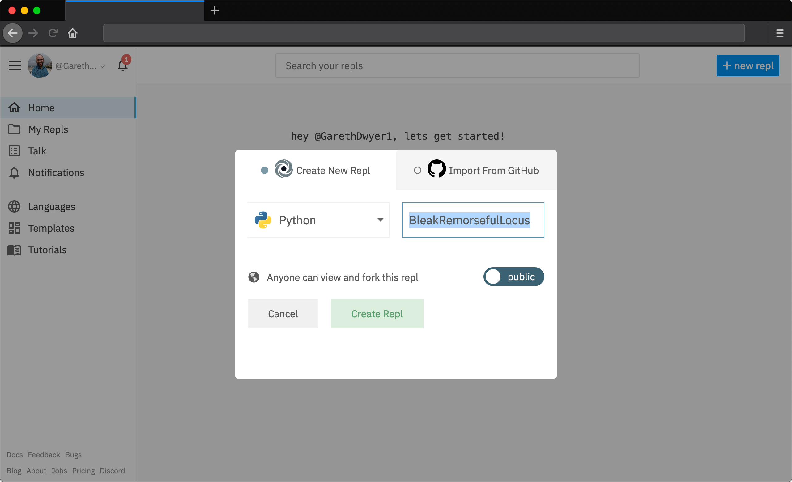
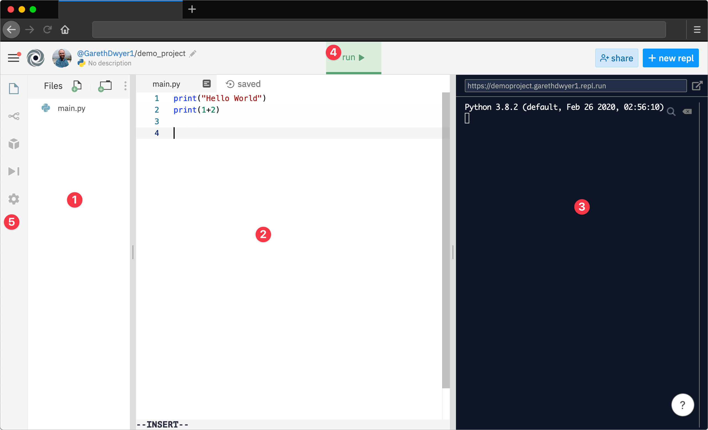

# Understanding the Repl IDE: a practical guide to building your first project with Repl

Software developers can get pretty attached to their Integrated Development Environments (IDEs) and if you look for advice on which one to use, you'll find no end of people advocating strongly for one over another. VS Code, Sublime Text, IntelliJ, Atom, Vim, Emacs, and no shortage of others.

In the end, an IDE is just a glorified text editor. It lets you type text into files and save those files, functionality that has been present in nearly all computers since those controlled by punch cards.

In this guide, we'll show you how to use the Repl IDE. It has some features you won't find in many others, namely:

* It's fully online. You can use it from any computer that can connect to the internet and run a web browser, including a phone or tablet.
* It'll fully manage your environment for building and running code too: you won't need to mess around with making sure you have the right version of Python or the correct NodeJS libraries.
* You can deploy any code you build to the public in one click too: no messing around with servers, or copying code around.

This guide is broken into three sections. Feel free to skip to the ones that seem most interesting to you.

**Introduction: how to create and run scripts and apps in any language**:
A tour of the basic functionality of Repl.it. You'll write your first app and run it, in Python and JavaScript.

**Multiplayer coding: how to code with your friends and colleagues in real time**:
One of Repl's unique features is multiplayer mode. You can edit the same file as someone else in real time.

**Extras included: Shells, package managers, keyboard shortcuts**:
Repl has a lot of features, some considered to be ... unnuatural. You'll see how you can import any library and use some of the "power" features.

## Introduction: how to create and run scripts and apps in any language

The easiest way to use Repl is to visit [repl.it](repl.it) and press the "start coding" button. You don't even need an account: simply select your language (probably start with Python or NodeJS if you're not sure) and you'll get taken straight to the IDE. However, to use some of the features that we'll cover (including multiplayer), you'll need an account, so let's start with that.

Visit [https://repl.it/signup](https://repl.it/signup) and follow the prompts to create a user account, either by entering a username and password or logging in with Google, GitHub, or Facebook.

Now that you have an account, you're ready to start writing software and sharing it with the world.

Once you have an account and are signed in, hit the "+ new repl" button in the top right. In the example below, I'm choosing to create a new Python project. Repl will automatically choose a random name for your project, or you can pick one yourself. Note that by default your Repl will be public to anyone on the internet: this is great for sharing and collaboration, but we'll have to be careful to not include passwords or other sensitive information in any of our projects.

You'll also notice an "Import from GitHub" option. Repl allows you to import existing software projects directly from GitHub, but we'll create our own for now. Once your project is created, you'll be taken to a new view with several panes. Let's take a look at what these are.

### Understanding the Repl panes

You'll soon see how configurable Repl is and how most things can be moved around to your fancy. However, by default you'll get the following layout.

1. **Left pane: files and configuration.** This, by default, shows up all the files that make up your project. Because we chose a Python project, Repl.it has gone ahead and create a `main.py` file there already
2. **Middle pane: code editor.** You'll probably spend most of your time using this pane. It's a text editor where you can write code. In the screenshot, I've added two lines of Python code, which we'll run in a bit.
3. **Right pane: output sandbox.** This is where you'll see your code in action. All output that your program produces will appear in this pane, and it also acts as a quick sandbox to run small pieces of code, which we'll look at more later.
4. **Run button.** If you click the big green run button, your code will be executed and the output will appear on the right.
5. **Menu bar.** By default the left pane (1) shows the files that make up your project, but you can use this bar to view other things here too by clicking on the various icons. From top-to-bottom you have files (the current view), version control (a way to save and check point your code as you progress), Packages (how to install third-party libraries), Debugger (to help you fix your code when it doesn't behave as expected, and Settings (to configure the Repl IDE itself. We'll see more of all of these options later, but for now enough theory. Let's get coding.

### Running code from a file

### Running code from Repl's Repl

### Adding more files and linking files

### Sharing your code

### The special .env file

### Sharing (deploying) your application

## Multiplayer coding: how to code with your friends and colleagues in real time

### Inviting people using multiplayer mode

### Things to keep in mind

* Keep your credentials safe
* Hosting the multiplayer session

## Extras included: Shells, package managers, keyboard shortcuts

### Importing third party libraries
* Adding a file
* Magic package management: import to install

### Keyboard shortcuts
* General shortcuts
* Using vim mode

### Running directly from GitHub

* importing repos
* using the .replit file for cusom commands

## Where next?

Once you understand everything in this post, you can create and deploy basically any app, all from within the Repl IDE. You might want to have a look at

* The official Repl docs
* //todo: selection of other tutorials etc

